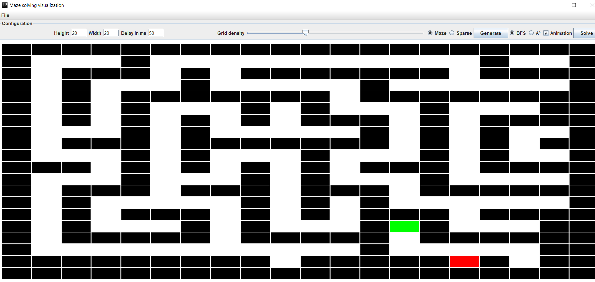

# Maze solver
Maze generator and solver with visualization written on Java using Swing and AWT frameworks.

* BFS and A* (using Manhattan distances) pathfinding algorithms
* Random DFS and sparse grid generating methods
* Load/Save solved or generated mazes
* Change height/width/animation delay and density of sparse grid

